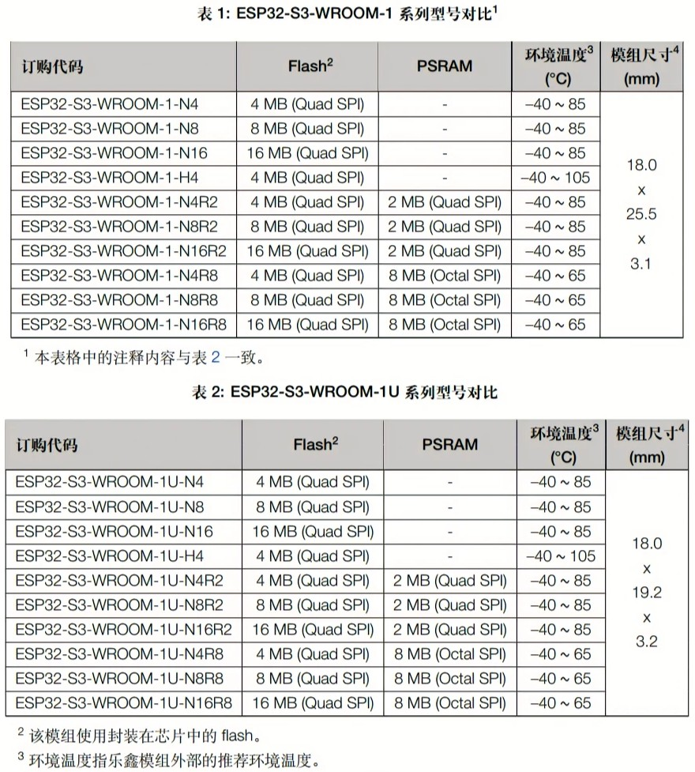

# esp32-s3-wroom-1-n16r8.yaml

_ESPHome version 2023.12.3_

Working config to fully exploit those boards, with 16MB flash (quad), 512KB SRAM, and 8MB PSRAM (octal).

The partitions file is the [default 16MB of espressif/arduino-esp32](https://github.com/espressif/arduino-esp32/blob/master/tools/partitions/default_16MB.csv). If you don't use the newer definition of partitions, you will get `core_dump` errors in the logs on boot. Just put it in the defined path (with vscode or other).

You can verify with the logger set on DEBUG that the PSRAM is working, you should see a few indented lines titled `PSRAM:` saying `Available: YES` and giving you its size. You can also enable the `debug` component to see it in action.

It should work the same for other `NxRy` boards, just adjust the values accordingly. Don't forget the `board_build.arduino.memory_type` config too; `NxR2` versions are `qio_qspi` (quad), not `qio_opi` (octal), see below.

